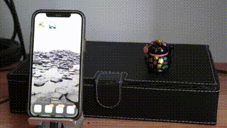

# CombineAPIRrest
This repository contains a sample iOS application. The app implements a simple iOS app that reads and writes sample NDEF data on an NFC tag. This is the base code used in following post [Harnessing NFC Technology in your iOS App]https://javios.eu/swift/harnessing-nfc-technology-in-your-ios-app/)

## 🎥 Demo Video

Check out the app in action!  
  

[Youtube](https://youtu.be/KQC92SKTqRg)

## Requirements

- **Xcode 15.0 or later**
- **iOS 16.0 or later**
- **Swift 6.0**

